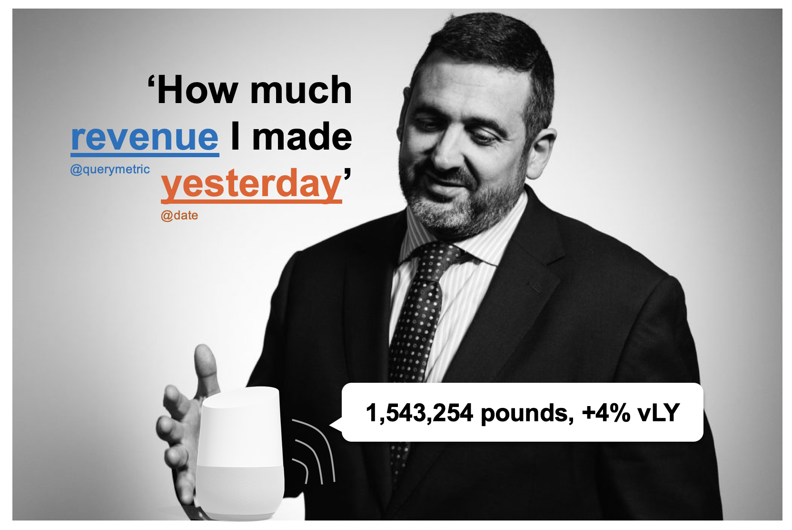
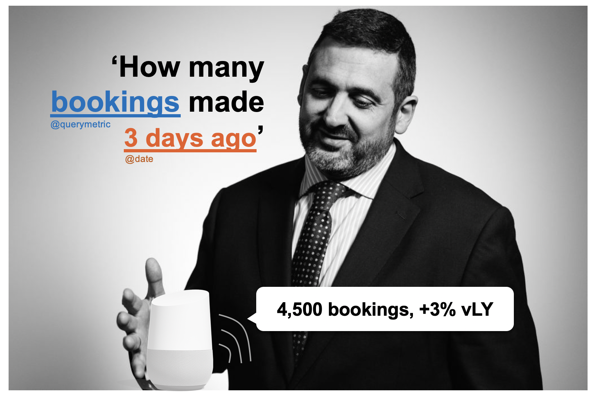
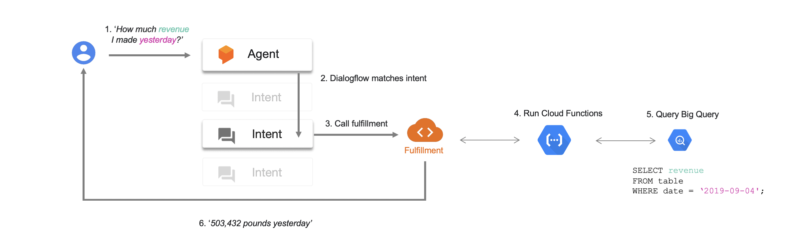
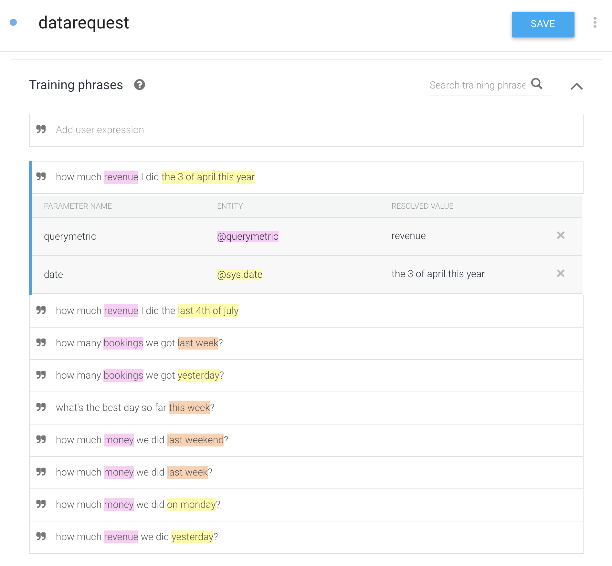

# ceo-reporting
The voice assistant that your CEO will love






### 1. Generate Dummy dataset

```python
import pandas as pd
from datetime import datetime
import numpy as np

# create DatetimeIndex
date_rng = pd.date_range(start='1/1/2018', end='9/5/2019', freq='D') # m/d/yyyy

# create dataframe
df = pd.DataFrame(date_rng, columns=['date'])

# create column 'revenue' with random values
df['revenue'] = np.random.randint(3000000,6000000,size=(len(date_rng)))

# create column 'bookings' with random values
df['bookings'] = np.random.randint(10000,20000,size=(len(date_rng)))

# export csv file (you can create the table in BigQuery from pandas dataframe as well)
df.to_csv(<path>)
```
### 2. Create Dataset and Table in BigQuery

### 3. Set up dialogflow

First, make sure you understand the basics of Dialogflow: you can start [here](https://cloud.google.com/dialogflow/docs/).




### 4. Create Cloud Function

```javascript
const {BigQuery} = require('@google-cloud/bigquery');

exports.ceo = functions.https.onRequest((request,response) =>{

        async function datarequest(agent) {

        const bigquery = new BigQuery();

        let metric
        let dimension
        let date = agent.parameters.date
        console.log(date.substr(0, 10))
        let dateString = date.substr(0, 10)
        agent.add(dateString)
        //let dateString = date.substr(0, 10);
            // Queries the U.S. given names dataset for the state of Texas.

        //agent.add(dateString)

        if (agent.parameters.querymetric === 'revenue') {
            metric    = 'revenue'
            dimension = 'pounds'
        } else if (agent.parameters.querymetric === 'bookings') {
            metric    = 'bookings'
            dimension = 'bookings'
        }

        console.log(`Reading ${metric} ${dimension}`)
        const query = `SELECT ${metric} FROM testceo.ceo WHERE date = '${dateString}'`;

        const options = {
            query: query,
            // Location must match that of the dataset(s) referenced in the query.
            location: 'US',
        };

        // Run the query as a job
        const [job] = await bigquery.createQueryJob(options);
        console.log(`Job ${job.id} started.`);

        // Wait for the query to finish
        const [rows] = await job.getQueryResults();

        // Print the results
        console.log('Rows:');

        const revenue = rows[0][metric]
        agent.add(`${revenue.toString()} ${dimension}`);
        // add vlY
        // add error handler
        //rows.forEach(row => console.log(row));


    }
    
 
}

```
